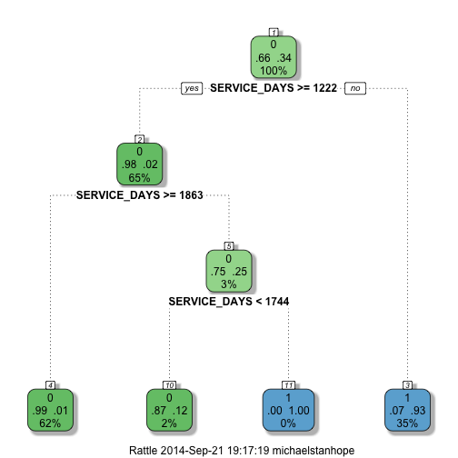

# Why do employees leave? 


```r
setwd("/Users/michaelstanhope/datascience/work/Data Science/Employee Leavers")
set.seed(1)
# Load Data
hrData <- read.csv("HR_Extract_Emp.csv")

# Convert salary to £k and filter anomalously high salaried employees
hrData$SALARY <- hrData$SALARY/1000
hrData <- hrData[which(hrData$SALARY < 2000),]

library(caret)
inHr <- createDataPartition(hrData$LEAVE_FLAG, p=0.6, list=FALSE)
training <- hrData[inHr,]
validation <- hrData[-inHr,]

training$LEAVE_FLAG <- as.factor(training$LEAVE_FLAG)
training<-training[,c("SALARY",    
                      "SERVICE_DAYS",    
                      "AGE",	
                      "LEAVE_FLAG",	
                      "HOURS",	
                      "DAYS_IN_JOB",	
                      "DAYS_IN_POS",	
                      "DAYS_IN_ORG")]

modFit <- train(LEAVE_FLAG ~ ., method="rpart", data=training)

library(rattle)
library(rpart.plot)
fancyRpartPlot(modFit$finalModel)
```

 

### In-sample error 


```r
confusionMatrix(training$LEAVE_FLAG, predict(modFit, training, na.action=na.pass))
```

```
## Confusion Matrix and Statistics
## 
##           Reference
## Prediction    0    1
##          0 2260  358
##          1  256 1169
##                                         
##                Accuracy : 0.848         
##                  95% CI : (0.837, 0.859)
##     No Information Rate : 0.622         
##     P-Value [Acc > NIR] : < 2e-16       
##                                         
##                   Kappa : 0.673         
##  Mcnemar's Test P-Value : 4.58e-05      
##                                         
##             Sensitivity : 0.898         
##             Specificity : 0.766         
##          Pos Pred Value : 0.863         
##          Neg Pred Value : 0.820         
##              Prevalence : 0.622         
##          Detection Rate : 0.559         
##    Detection Prevalence : 0.648         
##       Balanced Accuracy : 0.832         
##                                         
##        'Positive' Class : 0             
## 
```

### Out-of-sample error


```r
confusionMatrix(validation$LEAVE_FLAG, predict(modFit, validation, na.action=na.pass))
```

```
## Confusion Matrix and Statistics
## 
##           Reference
## Prediction    0    1
##          0 1504  267
##          1  131  793
##                                         
##                Accuracy : 0.852         
##                  95% CI : (0.838, 0.866)
##     No Information Rate : 0.607         
##     P-Value [Acc > NIR] : < 2e-16       
##                                         
##                   Kappa : 0.683         
##  Mcnemar's Test P-Value : 1.32e-11      
##                                         
##             Sensitivity : 0.920         
##             Specificity : 0.748         
##          Pos Pred Value : 0.849         
##          Neg Pred Value : 0.858         
##              Prevalence : 0.607         
##          Detection Rate : 0.558         
##    Detection Prevalence : 0.657         
##       Balanced Accuracy : 0.834         
##                                         
##        'Positive' Class : 0             
## 
```


